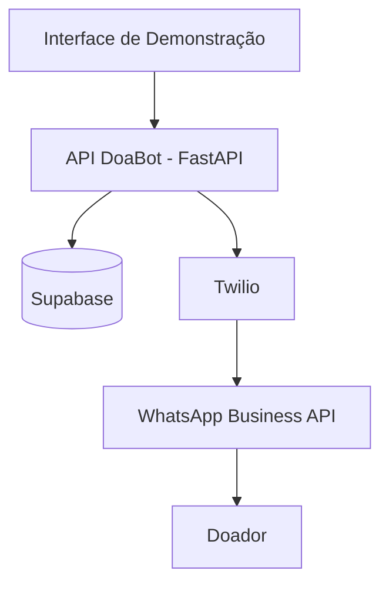
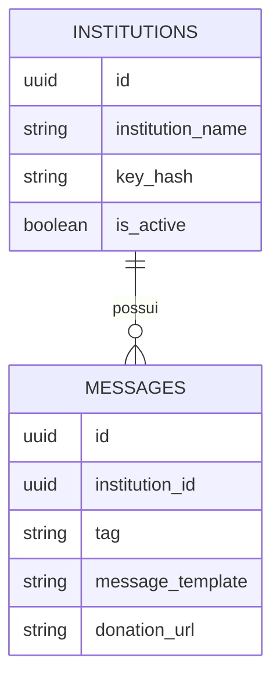

# Chatbot de Divulgação e Arrecadação de Doações — WhatsApp

## Visão Geral

O DoaBot é uma API desenvolvida para facilitar o envio de mensagens de arrecadação para doadores através do WhatsApp.

A solução permite que instituições cadastrem templates de mensagens associados a diferentes tipos de campanhas, como arrecadação de alimentos, roupas ou fraldas. Quando uma solicitação de envio é recebida pela API, o sistema seleciona o template correspondente, personaliza a mensagem com os dados do destinatário e realiza o envio utilizando a integração com a Twilio e a WhatsApp Business API.

Atualmente, o projeto é composto por:

- **Backend em FastAPI**, responsável pelo gerenciamento das instituições, templates e envio das mensagens.
- **Banco de dados Supabase**, utilizado para armazenamento das informações do sistema.
- **Integração com Twilio e WhatsApp Business API**, responsável pela entrega das mensagens aos doadores.
- **Interface administrativa de demonstração**, desenvolvida exclusivamente para validar e apresentar as funcionalidades da API durante o desenvolvimento do projeto.

É importante destacar que a interface admistrativa não representa um produto final. Ela foi criada para demonstrar o funcionamento dos endpoints da API e facilitar os testes
das funcionalidades implementadas.

O principal objetivo do DoaBot é fornecer uma base para automatização de campanhas de arrecadação, aumentando o alcance das intituições aos seus doadores e permitindo que futuras aplicações possam se integrar à API para gerenciar campanhas de forma centralizada.

# Arquitetura da Solução

O DoaBot segue uma arquitetura baseada em API, onde as regras de negócio ficam centralizadas no backend, com endpoints e armazenamento de dados comuns. Os serviços externos são responsáveis por realizarem as requisições ao DoaBot.

## Componentes

### Backend (FastAPI)

Responsável por:

- Registro, edição e exclusão de instituições;
- Cadastro e manipulação de templates de mensagens;
- Validação de credenciais e chaves de acesso;
- Montagem das mensagens personalizadas;
- Integração com o banco de dados;
- Integração com a API da Twilio para envio das mensagens.

### Banco de Dados (Supabase)

Responsável pelo armazenamento de:

- Instituições cadastradas;
- Templates de mensagens;
- URLs de doação associadas às campanhas.

### Twilio + WhatsApp Business API

Responsável pela entrega das mensagens aos destinatários através do WhatsApp.

### Interface de Demonstração

Aplicação web utilizada para demonstrar e validar as funcionalidades da API durante o desenvolvimento do projeto.

Essa interface permite:

- Gerenciar instituições;
- Cadastrar templates;
- Realizar o envio de campanhas.

---

## Arquitetura Geral



# Tecnologias Utilizadas

## Backend

| Tecnologia | Finalidade                                |
| ---------- | ----------------------------------------- |
| Python     | Linguagem principal do projeto            |
| FastAPI    | Desenvolvimento dos endpoints REST da API |
| Pydantic   | Validação de payloads e modelos de dados  |
| Uvicorn    | Servidor ASGI para execução da aplicação  |

## Banco de Dados

| Tecnologia | Finalidade                                                           |
| ---------- | -------------------------------------------------------------------- |
| Supabase   | Armazenamento de instituições, templates e demais dados da aplicação |

## Integração com WhatsApp

| Tecnologia            | Finalidade                          |
| --------------------- | ----------------------------------- |
| Twilio                | Intermediação do envio de mensagens |
| WhatsApp Business API | Entrega das mensagens aos doadores  |

## Frontend de Demonstração

| Tecnologia  | Finalidade                                |
| ----------- | ----------------------------------------- |
| HTML5       | Estrutura das páginas                     |
| CSS3        | Estilização da interface                  |
| JavaScript  | Lógica de interação com a API             |
| Bootstrap 5 | Componentes e responsividade da interface |

## Infraestrutura e Deploy

| Tecnologia | Finalidade                 |
| ---------- | -------------------------- |
| Render     | Hospedagem e deploy da API |
| GitHub     | Hospedagem do código-fonte |

## Gerenciamento do Projeto

| Tecnologia      | Finalidade                                                  |
| --------------- | ----------------------------------------------------------- |
| Git             | Controle de versão local                                    |
| GitHub          | Hospedagem do repositório remoto                            |
| GitHub Projects | Organização das tarefas e acompanhamento do desenvolvimento |

---

# Banco de Dados

O DoaBot utiliza o Supabase como banco de dados principal para armazenamento das informações necessárias ao funcionamento da API.

Atualmente, o banco é responsável por armazenar os dados das instituições cadastradas e dos templates de mensagens utilizados nas campanhas de arrecadação.

## Modelo de Dados

### Tabela: `institutions`

Armazena as instituições autorizadas a utilizar a API.

| Campo              | Descrição                                                      |
| ------------------ | -------------------------------------------------------------- |
| `id`               | Identificador único da instituição                             |
| `institution_name` | Nome da instituição                                            |
| `key_hash`         | Chave utilizada para autenticação das requisições              |
| `is_active`        | Indica se a instituição está habilitada para utilização da API |
| `created_at`       | Data de criação do registro                                    |
| `updated_at`       | Data da última atualização                                     |

### Tabela: `messages`

Armazena os templates de mensagens associados às campanhas.

| Campo              | Descrição                                            |
| ------------------ | ---------------------------------------------------- |
| `id`               | Identificador único do template                      |
| `institution_id`   | Instituição proprietária do template                 |
| `tag`              | Categoria da campanha (alimentos, roupas ou fraldas) |
| `message_template` | Conteúdo da mensagem enviada ao doador               |
| `donation_url`     | Link opcional para realização da doação              |
| `created_at`       | Data de criação do registro                          |
| `updated_at`       | Data da última atualização                           |

## Relacionamento entre Tabelas

Cada instituição pode possuir diversos templates de mensagens.

```text
institutions
    |
    | 1:N
    |
messages
```

Ou seja:

- Uma instituição pode possuir vários templates.
- Cada template pertence a uma única instituição.

## Diagrama Entidade-Relacionamento



## Controle de Acesso

A autenticação das instituições é realizada através do campo `key_hash`.

Ao receber uma requisição, a API valida se:

- A chave enviada corresponde a uma instituição cadastrada;
- A instituição está marcada como ativa (`is_active = true`).

Essa abordagem permite desabilitar o acesso de uma instituição sem remover seus dados do banco de dados.

---

# Backend

O backend do DoaBot foi desenvolvido utilizando FastAPI e segue uma arquitetura organizada por camadas, separando responsabilidades entre endpoints, modelos, integrações externas e regras de negócio.

A API é responsável por:

- Gerenciar instituições cadastradas;
- Gerenciar templates de mensagens;
- Validar autenticação através de API Keys;
- Processar solicitações de envio;
- Selecionar templates de acordo com a campanha;
- Integrar com a Twilio para entrega das mensagens;
- Registrar e consultar dados armazenados no Supabase.

---

## Estrutura da API

```text
src/
└── api/
    ├── internal/
    │   ├── endpoints/
    │   ├── payloads/
    │   ├── responses/
    │   └── router.py
    │
    ├── public/
    │   ├── endpoints/
    │   ├── payloads/
    │   ├── responses/
    │   └── router.py
    │
    ├── dependencies/
    ├── middlewares/
    ├── app.py
    ├── base_response.py
    └── exceptions.py
```

---

## Endpoints Internos

Os endpoints internos são utilizados para administração do sistema.

Essas rotas exigem autenticação através da chave administrativa (`INTERNAL_API_KEY`).

### Instituições

| Método | Endpoint                      | Descrição                |
| ------ | ----------------------------- | ------------------------ |
| POST   | `/internal/institutions`      | Cadastra uma instituição |
| GET    | `/internal/institutions`      | Lista instituições       |
| PATCH  | `/internal/institutions/{id}` | Atualiza uma instituição |
| DELETE | `/internal/institutions/{id}` | Remove uma instituição   |

### Templates de Mensagem

| Método | Endpoint                               | Descrição            |
| ------ | -------------------------------------- | -------------------- |
| POST   | `/internal/institutions/{id}/messages` | Cria um template     |
| GET    | `/internal/institutions/{id}/messages` | Lista templates      |
| PATCH  | `/internal/messages/{id}`              | Atualiza um template |
| DELETE | `/internal/messages/{id}`              | Remove um template   |

---

## Endpoints Públicos

Os endpoints públicos são utilizados pelos sistemas externos que desejam solicitar o envio de campanhas.

Essas rotas utilizam a API Key da instituição.

### Envio de Mensagens

| Método | Endpoint           | Descrição                                       |
| ------ | ------------------ | ----------------------------------------------- |
| POST   | `/api/v1/messages` | Envia mensagens para uma lista de destinatários |

---

## Integrações Externas

### Supabase

Utilizado para:

- Armazenamento das instituições;
- Armazenamento dos templates;
- Consulta das informações necessárias para montagem das mensagens.

### Twilio

Utilizada para:

- Comunicação com a WhatsApp Business API;
- Envio das mensagens para os destinatários.

---

## Sistema de Logs

A aplicação possui um mecanismo de logging para rastreamento das operações executadas.

Os logs registram:

- Recebimento de requisições;
- Consultas ao banco de dados;
- Integrações externas;
- Erros e exceções;
- Fluxo de envio de mensagens.

Esse mecanismo facilita a identificação de falhas e o monitoramento da aplicação em produção.

---

## Tratamento de Erros

A API utiliza respostas padronizadas para sucesso e falha.

As exceções são centralizadas através da classe `APIException`, garantindo consistência nas respostas retornadas ao cliente.

Exemplo:

```json
{
  "status_code": 400,
  "message": "Failed to create message."
}
```

---

## Segurança

O backend implementa dois níveis de autenticação:

### Chave Administrativa

Utilizada pelos endpoints internos.

```text
X-API-Key: INTERNAL_API_KEY
```

### Chave da Instituição

Utilizada pelos endpoints públicos.

```text
X-API-Key: INSTITUTION_KEY
```

As chaves são armazenadas no banco através de hashes, evitando exposição direta das credenciais.

---

# Estrutura do Projeto

```text
.
├── frontend/
│   ├── assets/
│   ├── components/
│   ├── pages/
│   └── index.html
│
├── scripts/
│
├── src/
│   ├── api/
│   │   ├── dependencies/
│   │   ├── enum/
│   │   ├── internal/
│   │   │   ├── endpoints/
│   │   │   ├── payloads/
│   │   │   ├── responses/
│   │   │   └── router.py
│   │   │
│   │   ├── middlewares/
│   │   ├── payloads/
│   │   ├── public/
│   │   │   ├── endpoints/
│   │   │   ├── payloads/
│   │   │   ├── responses/
│   │   │   └── router.py
│   │   │
│   │   ├── app.py
│   │   ├── base_response.py
│   │   └── exceptions.py
│   │
│   ├── clients/
│   ├── config/
│   ├── enum/
│   │   └── status_enum.py
│   │
│   ├── etc/
│   ├── models/
│   └── utils/
│
├── .env
├── .env.example
├── .gitignore
├── Pipfile
├── Pipfile.lock
└── README.md
```

## Organização dos Diretórios

### `src/api`

Contém todos os endpoints da API, payloads, respostas e roteadores.

### `src/models`

Modelos de domínio da aplicação utilizados para representar instituições, mensagens e demais entidades do sistema.

### `src/clients`

Integrações externas utilizadas pela aplicação, como Supabase e Twilio.

### `src/config`

Configurações de ambiente e parâmetros necessários para execução do sistema.

### `src/utils`

Funções auxiliares utilizadas em diferentes partes do projeto.

### `frontend`

Interface administrativa desenvolvida para demonstração e validação das funcionalidades da API.

# Estratégia de Branches

Atualmente o projeto mantém duas branches principais:

## `main`

Branch estável da aplicação.

Contém exclusivamente o backend da API e representa a versão principal do sistema.

Essa branch é utilizada como referência para deploy e para disponibilização da API de forma independente da interface de demonstração.

## `dev`

Branch de desenvolvimento ativo.

Além do backend, contém a interface administrativa criada para demonstrar e validar as funcionalidades da API durante o desenvolvimento do projeto.

Novas funcionalidades são implementadas inicialmente nesta branch antes de serem avaliadas para incorporação à branch principal.

## Motivo da Separação

A interface administrativa foi criada apenas para fins de demonstração do funcionamento da API.

Como ela não faz parte do produto final planejado, optou-se por manter:

- `main` contendo apenas a API;
- `dev` contendo a API e a interface de demonstração.

Dessa forma, é possível evoluir e demonstrar o sistema sem impactar a versão principal do backend.

---

## Como rodar o chatbot do zero (passo a passo para novos usuários)

1. **Clone o repositório:**

   ```bash
   git clone https://github.com/SEU_USUARIO/NOME_DO_REPOSITORIO.git
   cd NOME_DO_REPOSITORIO
   ```

2. **Crie e ative um ambiente virtual Python:**

   ```bash
   python -m venv venv

   # No Windows:
   venv\Scripts\activate

   # No Linux/Mac:
   source venv/bin/activate
   ```

3. **Instale as dependências:**

   O projeto utiliza o `Pipfile`. Você pode instalar usando o pipenv:

   ```bash
   pip install pipenv
   pipenv install
   ```

4. **Suba o servidor localmente:**

   ```bash
   pipenv run api
   ```
